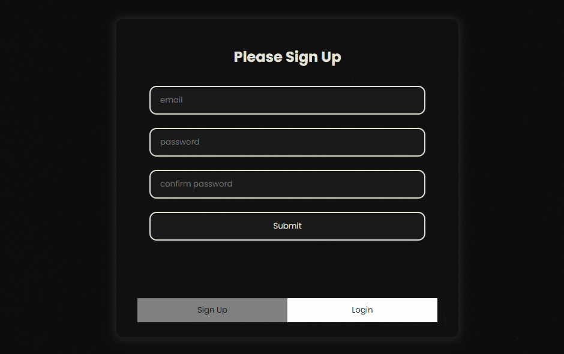
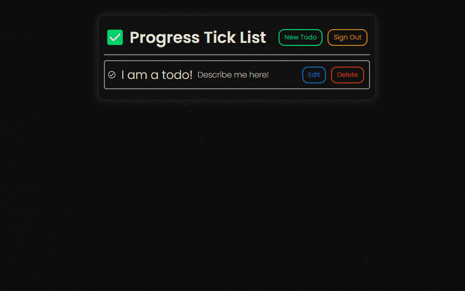
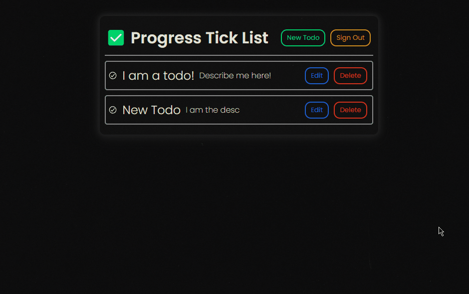
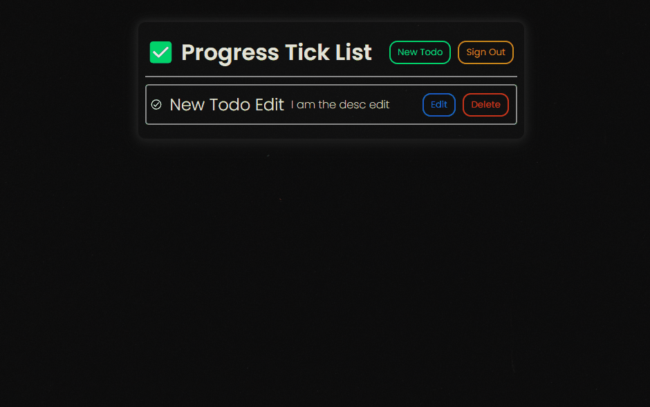
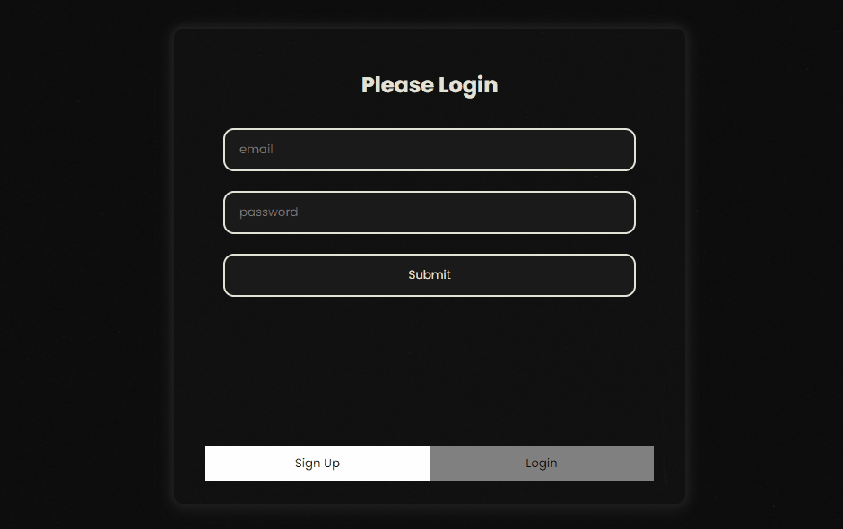
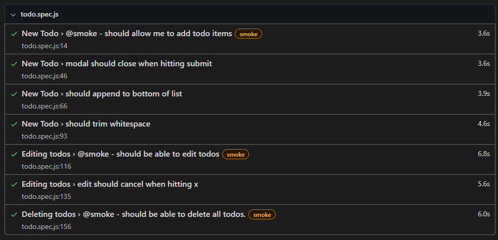
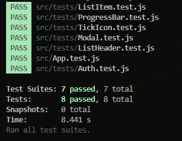
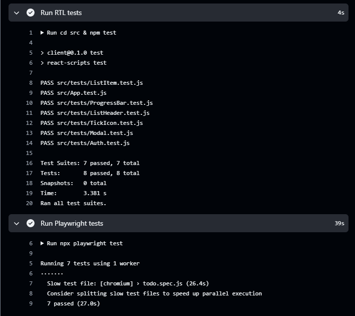

# Todos App Client ☑️

This is a CRA manipulating data from an Express API backend connected to a PostgreSQL database using Knexjs.

**[Server Documentation](https://github.com/cheyroseflammer/progressTodoServer/blob/main/README.md)**

**[Live Site](https://progress-todo-app.vercel.app)**

## Starting the project 🚀

Clone App: `git clone https://github.com/cheyroseflammer/progressTodoClient.git`

Install dependencies: `npm install`

Component Render Tests: `cd src` & `npm test` (all tests should pass)

E2E Tests on Production: `npx playwright text`

Start client: `npm start`

## User Stories 👤

### _As a user I should be able to:_

✅ Done

- **Sign Up** - High Priority 🔴



- **Create New Todo** - High Priority 🔴



- **Delete Todo** - High Priority 🔴



- **Edit Todo** - High Priority 🔴


- **Sign Out** - High Priority 🔴



- **Login** - High Priority 🔴



🟨 In Progress

- **Check Todo Off** - Low Priority 🟡

- **See progress bar** - Low Priority 🟡

## Data Fetching 🌐

**Get Data** 🟢

```js
const getData = async () => {
  try {
    const response = await fetch(`API_URL/${userEmail}`);
    const json = await response.json();
    setTodos(json.data);
  } catch (error) {
    console.log(error);
  }
};
useEffect(() => {
  getData();
}, []);
```

**Post Data** 🟢

```js
const postData = async (e) => {
  e.preventDefault();
  try {
    const response = await fetch('API_URL', {
      method: 'POST',
      headers: { 'Content-Type': 'application/json' },
      body: JSON.stringify({ data }),
    });
    if (response.status === 201) {
      console.log('Todo posted sucessfully');
      getData();
    }
  } catch (error) {
    console.log(error);
  }
};
```

**Put Data** 🟡

```js
const putData = async (e) => {
  e.preventDefault();
  try {
    const response = await fetch(`API_URL/${todo.user_email}/${todo.todo_id}`, {
      method: 'PUT',
      headers: { 'Content-Type': 'application/json' },
      body: JSON.stringify({ data }),
    });
    if (response.status === 200) {
      console.log('Todo updated sucessfully');
      getData();
    }
  } catch (error) {
    console.log(error);
  }
};
```

**Delete Data** 🔴

```js
const deleteData = async (e) => {
  e.preventDefault();
  try {
    const response = await fetch(`API_URL/${todo.user_email}/${todo.todo_id}`, {
      method: 'DELETE',
    });
    if (response.status === 204) {
      console.log('todo deleted successfully');
      getData();
    }
  } catch (error) {
    console.log(error);
  }
};
```

## E2E Tests with Playwright

Using Playwright all end to end and smoke tests were created to test full functionailty of the production build of the website.

Tests include:

- ✅ app should allow for new todos to be added
- ✅ apps modal should close once the submit button is hit
- ✅ todos should append to bottom of list
- ✅ white space should be trimmed from input on submit
- ✅ app should allow for todos to be edited
- ✅ edit should cancel when interacting with close X
- ✅ app should allow for todos to be deleted



## Component Render Tests with React Testing Library

RTL was used to assert the presence of components and their data.



## CI/CD with Github Actions

Continuous Integration and Continuous Delivery/Continuous Deployment using Github Actions and workflows.


