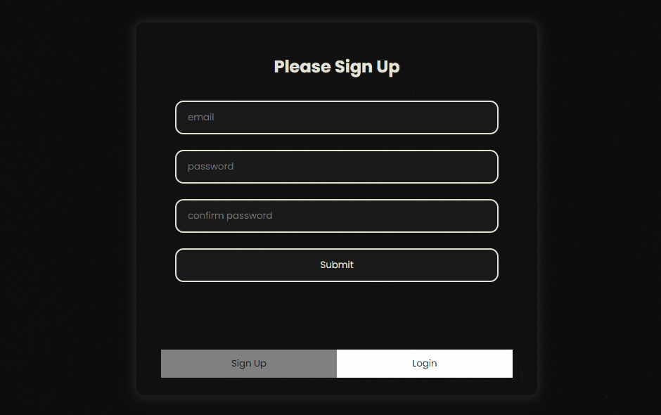
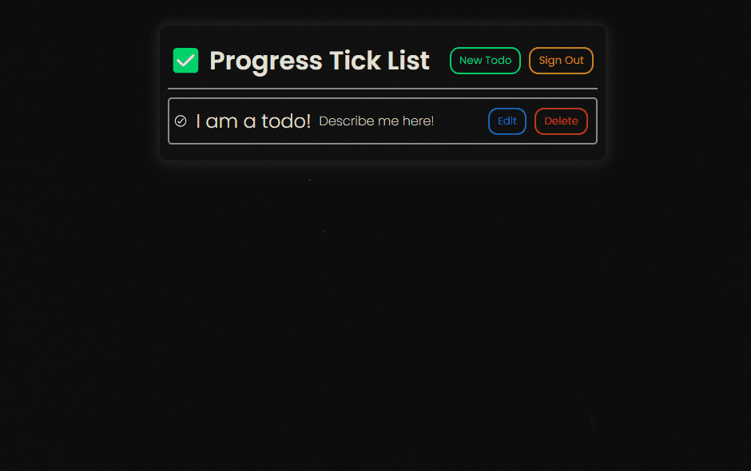
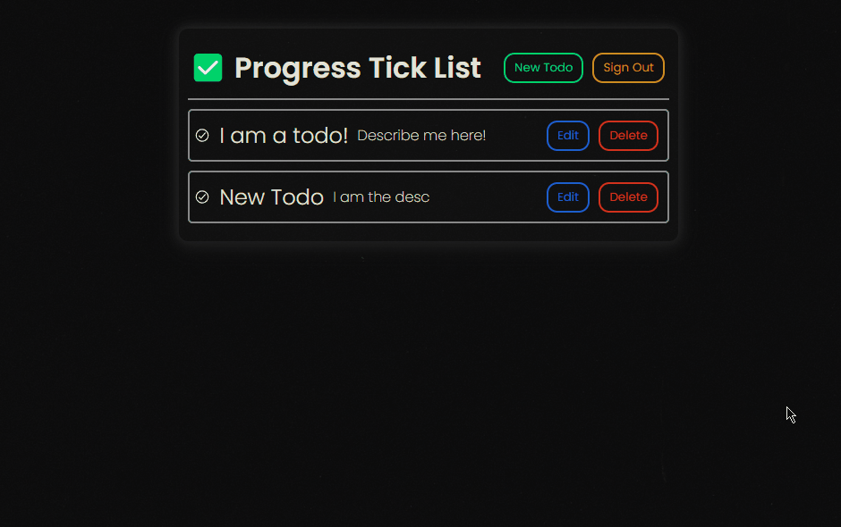
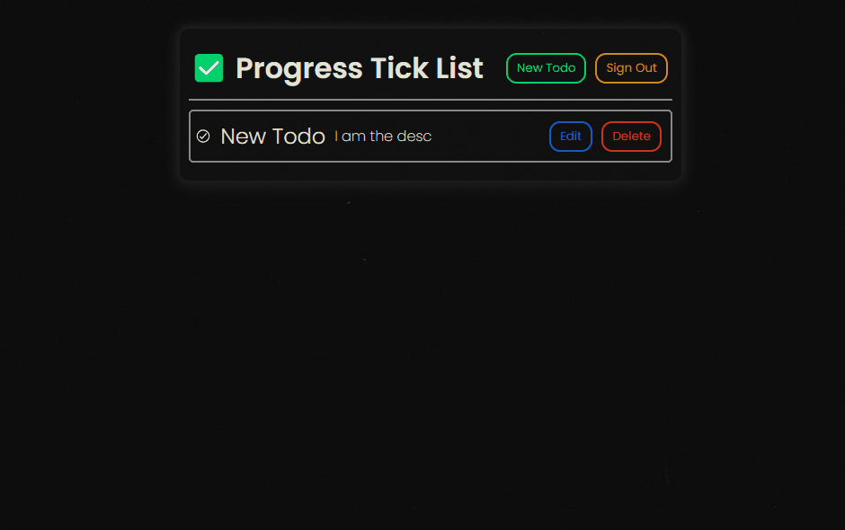
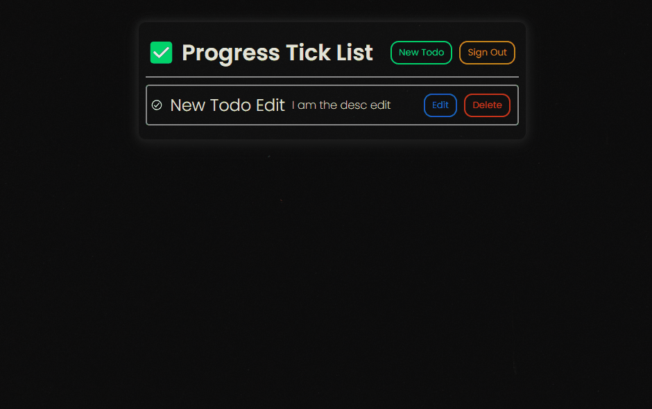
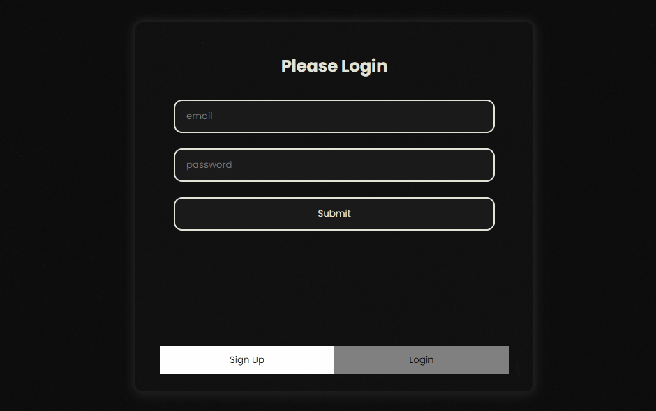

# Todos App Client ☑️

This is a CRA manipulating data from an Express API backend connected to a PostgreSQL database.

**Server Documentation:** `https://github.com/cheyroseflammer/progressTodoServer/blob/main/README.md`

**Live Site:** `https://progress-todo-app.vercel.app`

## Starting the project 🚀

Clone App: `git clone https://github.com/cheyroseflammer/progressTodoClient.git`

Install dependencies: `npm install`

Tests: `npm test` (all tests should pass)

Start client: `npm start`

## User Stories 👤

### _As a user I should be able to:_

✅ Done

- **Sign Up** - High Priority 🔴



- **Create New Todo** - High Priority 🔴



- **Delete Todo** - High Priority 🔴



- **Edit Todo** - High Priority 🔴



- **Sign Out** - High Priority 🔴



- **Login** - High Priority 🔴



🟨 In Progress

- **Check Todo Off** - Low Priority 🟡

- **See progress bar** - Low Priority 🟡

## Data Fetching 🌐

**Get Data** 🟢

```
  const getData = async () => {
    try {
      const response = await fetch(`API_URL/${userEmail}`);
      const json = await response.json();
      setTodos(json.data);
    } catch (error) {
      console.log(error);
    }
  };

  useEffect(() => {
    getData();
  }, []);
```

**Post Data** 🟢

```
  const postData = async (e) => {
    e.preventDefault();
    try {
      const response = await fetch('API_URL', {
        method: 'POST',
        headers: { 'Content-Type': 'application/json' },
        body: JSON.stringify({ data }),
      });
      if (response.status === 201) {
        console.log('Todo posted sucessfully');
        getData();
      }
    } catch (error) {
      console.log(error);
    }
  };

```

**Put Data** 🟡

```
  const putData = async (e) => {
    e.preventDefault();
    try {
      const response = await fetch(
        `API_URL/${todo.user_email}/${todo.todo_id}`,
        {
          method: 'PUT',
          headers: { 'Content-Type': 'application/json' },
          body: JSON.stringify({ data }),
        }
      );
      if (response.status === 200) {
        console.log('Todo updated sucessfully');
        getData();
      }
    } catch (error) {
      console.log(error);
    }
  };

```

**Delete Data** 🔴

```
const deleteData = async (e) => {
    e.preventDefault();
    try {
      const response = await fetch(
        `API_URL/${todo.user_email}/${todo.todo_id}`,
        {
          method: 'DELETE',
        }
      );
      if (response.status === 204) {
        console.log('todo deleted successfully');
        getData();
      }
    } catch (error) {
      console.log(error);
    }
  };
```

## Unit & Mock Testing

Unit testing with React testing library. API fetch testing with Jest mocks.

<!--  -->
